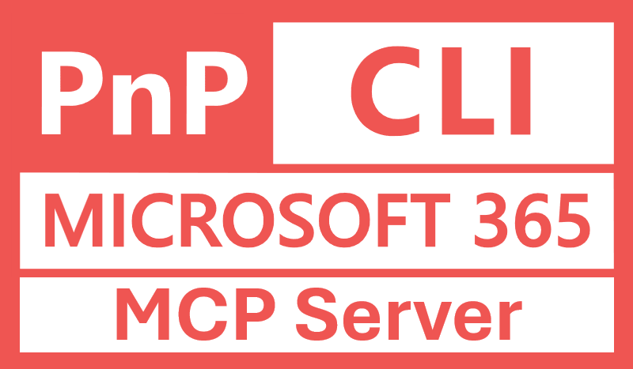
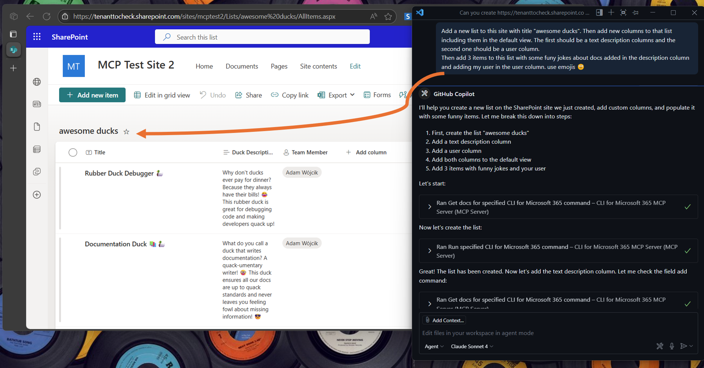
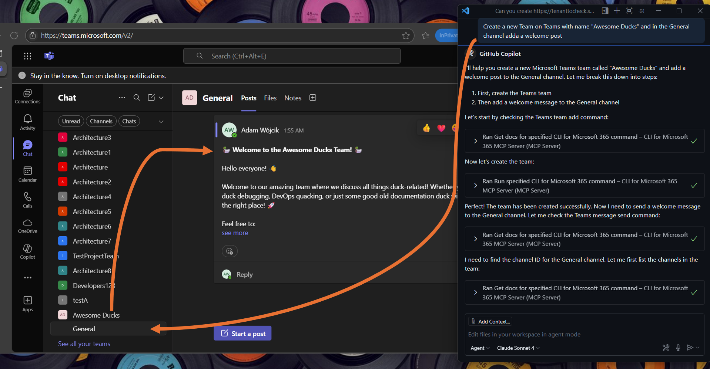
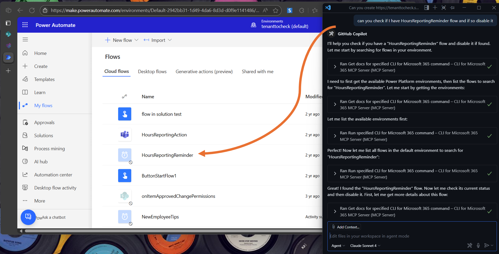
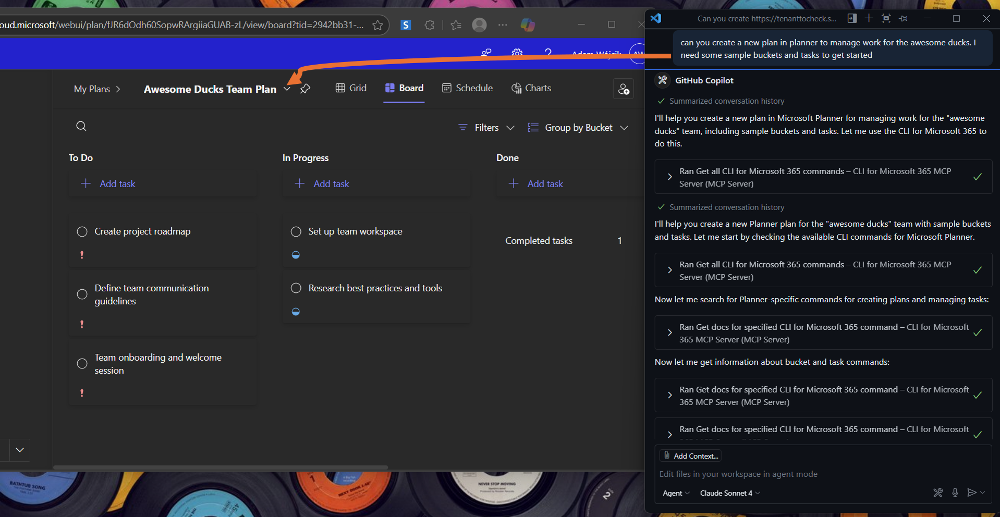

<h1 align="center">
  <a href="https://github.com/pnp/cli-microsoft365-mcp-server">
    
  </a>
  <br>CLI for Microsoft 365 MCP Server<br>
</h1>

[](https://insiders.vscode.dev/redirect/mcp/install?name=CLI%20for%20Microsoft%20365%20MCP%20Server&config=%7B%22command%22%3A%22npx%22%2C%22args%22%3A%5B%22-y%22%2C%22%40pnp%2Fcli-microsoft365-mcp-server%40latest%22%5D%7D) [](https://insiders.vscode.dev/redirect/mcp/install?name=CLI%20for%20Microsoft%20365%20MCP%20Server&config=%7B%22command%22%3A%22npx%22%2C%22args%22%3A%5B%22-y%22%2C%22%40pnp%2Fcli-microsoft365-mcp-server%40latest%22%5D%7D&quality=insiders)

## 💡 Description

This MCP server allows the use of natural language to execute any CLI for Microsoft 365 commands. It may handle complex prompts that will be executed as a chain of CLI for Microsoft 365 commands that will try to fulfill the user's request. Thanks to this, you may manage many different areas of Microsoft 365, for example: Entra ID, OneDrive, OneNote, Outlook, Planner, Power Apps, Power Automate, Power Platform, SharePoint Embedded, SharePoint Online, Teams, Viva Engage, and many more...

For best results, use it with Claude Sonnet 4 or Claude Sonnet 3.7.

## 📦 Prerequisites

- Node.js 20.x or higher
- CLI for Microsoft 365 installed globally (`npm i -g @pnp/cli-microsoft365`)

## 🚀 Installation & Usage

<h3>
  👉 Check out the <a href="https://pnp.github.io/cli-microsoft365/user-guide/using-cli-mcp-server/" title="CLI for Microsoft 365 MCP Server Guide">CLI for Microsoft 365 MCP Server Guide</a>
</h3>

<h3>
  👉 Check out the <a href="https://www.youtube.com/watch?v=p1PRLgN3Cqk" title="Getting Started recording">Getting Started recording 🎬</a>
</h3>

This MCP server uses the globally installed [CLI for Microsoft 365](https://pnp.github.io/cli-microsoft365) that you need to install globally using `npm i -g @pnp/cli-microsoft365`.

After you install the CLI for Microsoft 365 perform the initial setup by running the:

```
m365 setup
```

For more information, please follow the [Log in to Microsoft 365](https://pnp.github.io/cli-microsoft365/user-guide/connecting-microsoft-365)

After you set up the CLI for Microsoft 365, please update its configuration using the following commands:

```
m365 cli config set --key prompt --value false
m365 cli config set --key output --value text
m365 cli config set --key helpMode --value full
```

This will ensure that the MCP server will get as much information as possible from the CLI for Microsoft 365 when an error occurs or when a command is not executed properly.

The MCP server will not do any authentication for you. You will need to first authenticate using CLI for Microsoft 365 using [m365 login](https://pnp.github.io/cli-microsoft365/cmd/login) command. Once you are authenticated, the MCP server will use the same authentication context when running any tool.

Lastly, install the MCP server on your preferred MCP client, referring to the instructions of the picked MCP host. Below, you may find guidance for VS Code.

### Add to VS Code

There are multiple ways to add the MCP server to VS Code. The most common way is to:

1. Open the Command Palette (Ctrl+Shift+P or Cmd+Shift+P on macOS) and type `MCP: Add Server`.
2. Select `Command (stdio)` as the server type.
3. Enter the command to run the MCP server, which is:

   ```
   npx -y @pnp/cli-microsoft365-mcp-server@latest
   ```
4. Name the server (e.g., `CLI for Microsoft 365 MCP Server`).

As a result, you should have the following configuration in your `.vscode/mcp.json` file:

```json
{
    "servers": {
        "CLI for Microsoft 365 MCP Server": {
            "type": "stdio",
            "command": "npx",
            "args": [
                "-y",
                "@pnp/cli-microsoft365-mcp-server@latest"
          ]
        }
    }
}
```

Now when you open the GitHub Copilot chat in VS Code, you should be able to select the `CLI for Microsoft 365 MCP Server` from the list of available MCP servers and start using it to manage Microsoft 365 using natural language. In the prompt specify that "Using CLI for Microsoft 365, I want you to..." and GitHub Copilot Agent will use the MCP server to execute your request.

### Add to GitHub Copilot CLI

If you are using [GitHub Copilot CLI](https://docs.github.com/en/copilot/concepts/agents/about-copilot-cli), you may add the CLI for Microsoft 365 MCP server to Copilot by doing the following:

1. First of all start the [Copilot CLI](https://www.npmjs.com/package/@github/copilot) by running:

```
  copilot
```

2. Use the copilot mcp command to add the MCP server:

```
  /mcp add
```

3. This will open up the MCP form where you need to fill in the following details:
- Server name: basically whatever you like, but do not use space bar characters, e.g `cli-microsoft365-mcp-server`
- Server type: select `Local`
- Command: `npx`
- Arguments: `"-y", "@pnp/cli-microsoft365-mcp-server@latest"`
Rest of the fields you may leave with default values.

After that click on `Ctrl+S` to save the MCP server and `q` to exit the MCP form. 
Now you should be able to use the CLI for Microsoft 365 MCP server in GitHub Copilot CLI by specifying it in your prompt, e.g. "Using CLI for Microsoft 365, I want you to...".

### Add to Claude

When using [Claude Desktop](https://claude.ai/desktop) you may add the MCP server by doing either using the dedicated `.mcpb` file present in this repo (recommneded) or by adding it manually to the Claude Desktop configuration.

#### Using the .mcpb file (recommended)

1. Download the [cli-microsoft365-mcp-server.mcpb](./cli-microsoft365-mcp-server.mcpb) file from this repo.
2. In Claude Desktop, open Settings by clicking on the hamburger icon in the top left corner.
3. Select File > Settings (or press `Ctrl + ,`)
4. In the Extensions tab, click 'Advanced settings' button
5. In the 'Extension Developer' area, click on 'Install Extension' button ad select the downloaded `cli-microsoft365-mcp-server.mcpb` file.
6. Confirm the installation by clicking on 'Install' button.

All done! You should now be able to use the `CLI-Microsoft365` MCP server in Claude Desktop.  

#### Manually add to Claude Desktop configuration

1. In Claude Desktop, open Settings by clicking on the hamburger icon in the top left corner.
2. Select File > Settings (or press `Ctrl + ,`)
3. In the Developer tab, click Edit Config
  Note: If you don't see the Developer tab, you need to enable it first from Help > Enable Developer Mode.
4. This opens explorer, edit `claude_desktop_config.json` in your favorite text editor.
Add the following configuration to the file.

```json
{
  "mcpServers": {
    "CLI-Microsoft365": {
      "command": "npx",
      "args": ["-y", "@pnp/cli-microsoft365-mcp-server@latest"]
    }
  }
}
```

5. Exit Claude Desktop and restart it. Every time you make changes to the code or configuration, you need to restart Claude desktop for the changes to take effect.

> Note: In Windows, Claude doesn't exit when you close the window, it runs in the background. You can find it in the system tray. Right-click on the icon and select Quit to exit the application completely.

All done! You should now be able to use the `CLI-Microsoft365` MCP server in Claude Desktop.

## 🧠 LLM Suggestion 

For best results, use it with Claude Sonnet 4 or Claude Sonnet 3.7.

## 📷 Use Cases

The below uses cases are only a few example how you may use this MCP server. It is capable of handling many different tasks, so feel free to experiment with it and basically manage all of Microsoft 365 using natural language.

Also you may check the [CLI for Microsoft 365 wiki](https://github.com/pnp/cli-microsoft365-mcp-server/wiki) to find more [scenarios](https://github.com/pnp/cli-microsoft365-mcp-server/wiki/1.-Scenarios) how ClI for Microsoft 365 can be used to manage Microsoft 365.

### Manage SharePoint Online

In the following example, the MCP server created a SharePoint list with new columns and populated it with a few test items.

prompt: 
"Add a new list to this site with title "awesome ducks". Then add new columns to that list including them in the default view. The first should be a text description columns and the second one should be a user column.
Then add 3 items to this list with some funny jokes about docs added in the description column and adding my user in the user column. use emojis 🙂"



### Manage Microsoft Teams

The following example shows how to create a new Microsoft Teams team and add a welcome post to the General channel.

prompt:
"Create a new Team on Teams with name "Awesome Ducks" and in the General channel adda a welcome post"



### Manage Power Platform solutions 

In the example, the MCP server disables a Power Automate flow.

prompt:
"can you check if I have HoursReportingReminder flow and if so disable it"



### Manage Planner

In the following example, the MCP server creates a new Planner plan with sample buckets and tasks.

prompt:
"can you create a new plan in planner to manage work for the awesome ducks. I need some sample buckets and tasks to get started"



## 🛠️ Tools

| Tool | Description |
|----------|----------|
| m365SearchCommands | Searches CLI for Microsoft 365 commands using fuzzy search based on a query string. This is more efficient than getting all commands as it returns only relevant matches. Use this tool first to find relevant commands. |
| m365GetCommandDocs | Gets documentation for a specified CLI for Microsoft 365 command to be used by the Model Context Protocol to provide detailed information about the command along with examples, use cases, and option descriptions |
| m365RunCommand | Runs a specified CLI for Microsoft 365 command to be used by the Model Context Protocol to execute the command and return the result and reason over the response |
| m365GetBestPractices | Gets best practices for using CLI for Microsoft 365 in scripts, including guidance on authentication checking, error handling, output handling, and configuration |

## 🏗️ How to build and run it locally

Before anything, first run `npm install` to install all dependencies.

Then, in order to build the project run:

```
npm run build
```

### Running MCP in VS Code from local build

It is also possible to run the MCP server in VS Code from your local build so that it may be used by GitHub Copilot Agent.
First, start the CLI for Microsoft 365 MCP server using the command:

```
npm run start
```

Now go to VS Code GitHub Copilot Agent mode click on the tools icon, and select `Add more tools`. Then select `Add MCP server` and then `Command (stdio)` and enter the following command:

```
node FULL_PATH_TO_YOUR_PROJECT/dist/index.js
```

Click Enter and name it however you like. It is recommended to add it to `workspace` scope for testing. After that, open up your `.vscode/mcp.json` file and modify it so pass the environment variables needed for auth.

```json
{
    "servers": {
        "m365-mcp-server": {
            "type": "stdio",
            "command": "node",
            "args": [
                "FULL_PATH_TO_YOUR_PROJECT/dist/index.js" // e.g. C:/workspace/repo/microsoft-365-mcp-server/dist/index.js
            ]
        }
    }
}
```

### Running MCP from local build using the inspector (Debugging)

One of the ways to test the CLI for Microsoft 365 MCP server is by using the [MCP Inspector](https://github.com/modelcontextprotocol/inspector). 
Mostly, this setup is used for debugging purposes and to test the MCP server locally.
First, start the MCP server using the command:

```
npm run start
```

Now, in order to run the inspector for your MCP server, you need run the following command in the repo root folder location:

```
npx @modelcontextprotocol/inspector node dist/index.js
```

After that, wait for the inspector to start and open the inspector in your browser. You should see the MCP server running, and you should be able to query the tools and execute them locally.

## 🔗 Resources

- [typescript-sdk](https://github.com/modelcontextprotocol/typescript-sdk/tree/main)
- [MCP servers](https://github.com/modelcontextprotocol/servers?tab=readme-ov-file)
- [MCP inspector](https://github.com/modelcontextprotocol/inspector)

