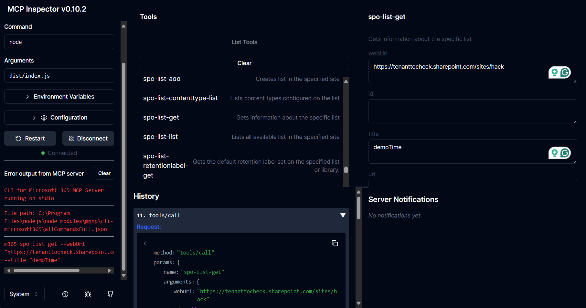
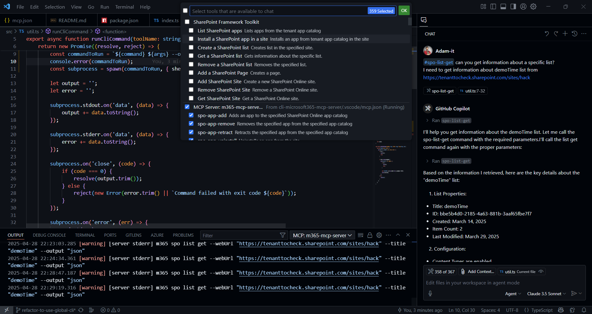

# Microsoft 365 MCP Server

## 💡 Description

Currently this is a work in progress and more POC than a solution. 
The goal is to create a MCP server that will allow to run any kind of CLI for Microsoft 365 command.

<a href="https://glama.ai/mcp/servers/@pnp/cli-microsoft365-mcp-server">
  
</a>

## 📦 Prerequisites

- Node.js 20.x or higher

## 🚀 How to build and run

Before anything first run `npm install` to install all dependencies.

Then in order to build the project run:

```
npm run build
```

In order to test this tool you will need to create a Entra app req and a certificate so that this MCP server can authenticate against Microsoft 365 as an app. In order to create a certificate and the app req with needed scopes and added it to your tenant along with the certificate runt the `createApp.ps1` script and follow along the instructions. Most of the things you may leave empty when creating the cert except the password. The password is needed. As the script uses [CLI for Microsoft 365](https://pnp.github.io/cli-microsoft365) to create the app req and other stuff you will first need to install CLI for Microsoft 365 globally using `npm i -g @pnp/cli-microsoft365` and sign in to your tenant as admin. After you executed the script you should see a 'MCP Server Test' app reg on your Entra ID with the needed scopes and certificate. You should also see the certificate file and the exported base64 encoded certificate in the `temp` folder. YOu will need them later.

### Running MCP using the inspector

One of the ways to test the M365 MCP server is using the [MCP Inspector](https://github.com/modelcontextprotocol/inspector). 
First start the M365 MCP server using the command:

```
npm run start
```

Now in order to run the inspector for your MCP server also passing down the needed parameters as environment so that the MCP server may pick them up and use them to authenticate against Microsoft 365 you can run the following command:

```
npx @modelcontextprotocol/inspector -e CertificatePassword='YOUR_PASSOWRD' -e AppId='ENTRA_APP_REG_ID' -e TenantId='TENANT_ID' -e TenantUrl='TENANT_URL' -e CertificateBase64Encoded='BASE64_ENCODED_VALUE_OF_YOUR_CERT' node dist/index.js
```

After that wait for the inspector to start and open the inspector in your browser. You should see the MCP server running and you should be able to query the tools and execute them locally.



### Running MCP in VS Code

It is also possible to run the MCP server in VS Code from your local build so that it may be used by GitHub Copilot Agent.
As of now this is only supported in VS Code Insiders.
First start the M365 MCP server using the command:

```
npm run start
```

Now go to VS Code GitHub Copilot Agent mode click on the tools icon and select `Add more tools`. Then select `Add MCP server` and then `Command (stdio)` and enter the following command:

```
node FULL_PATH_TO_YOUR_PROJECT/dist/index.js
```

Click enter and name it how ever you like. It is recommended to add it to `workspace` scope for testing. After that open up your `.vscode/mcp.json` file and modify it so pass the environment variables needed for auth.

```json
{
    "servers": {
        "m365-mcp-server": {
            "type": "stdio",
            "command": "node",
            "args": [
                "FULL_PATH_TO_YOUR_PROJECT/dist/index.js" // e.g. C:/workspace/repo/microsoft-365-mcp-server/dist/index.js
            ],
            "env": {
                "CertificateBase64Encoded": "BASE64_ENCODED_VALUE_OF_YOUR_CERT",
                "CertificatePassword": "YOUR_PASSOWRD",
                "AppId": "ENTRA_APP_REG_ID",
                "TenantId": "TENANT_ID",
                "TenantUrl": "TENANT_URL" // e.g. https://tenanttocheck.sharepoint.com/
            }
        }
    }
}
```

Click on start and you should see 4 new tools added to your GitHub Copilot Agent. Test them out.



## 🎬 Demo

👉 [Movie 🎬](https://1drv.ms/v/c/e82bbd5e6a08f219/ERGiLDUdw7VKi6Z01S_HTdkBPalukte7lJyiseIauFd2QA?e=gVezUZ)

## 🔗 Resources

- [typescript-sdk](https://github.com/modelcontextprotocol/typescript-sdk/tree/main)
- [MCP servers](https://github.com/modelcontextprotocol/servers?tab=readme-ov-file)
- [MCP inspector](https://github.com/modelcontextprotocol/inspector)
- [Use MCP servers in VS Code (Preview)](https://code.visualstudio.com/docs/copilot/chat/mcp-servers)
- [Use CLI for Microsoft 365 programmatically](https://pnp.github.io/cli-microsoft365/user-guide/use-cli-api)