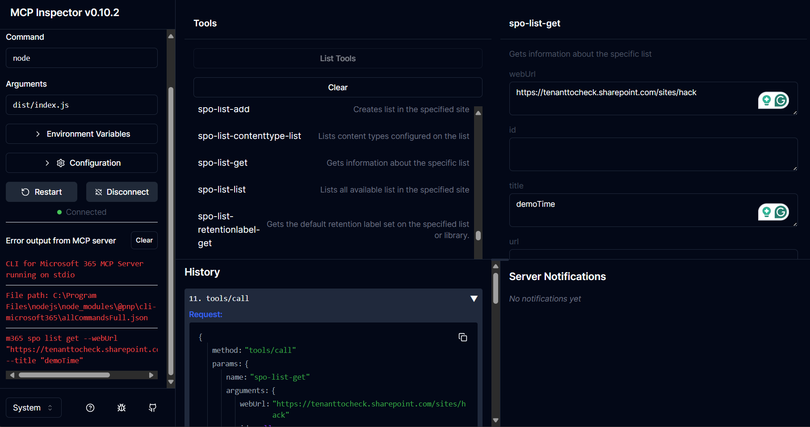
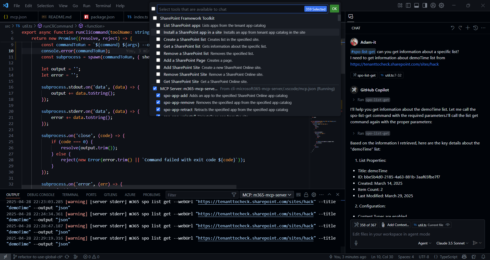

# CLI for Microsoft 365 MCP Server

## 💡 Description

Currently this is a work in progress and more POC than a solution. 

## 📦 Prerequisites

- Node.js 20.x or higher

## 🚀 How to build and run

Before anything first run `npm install` to install all dependencies.

Then in order to build the project run:

```
npm run build
```

This MCP server uses the globally installed [CLI for Microsoft 365](https://pnp.github.io/cli-microsoft365) that you need to install globally using `npm i -g @pnp/cli-microsoft365`.

The MCP server will not do any authentication for you. You will need to first authenticate using CLI for Microsoft 365 using the `m365 login` command. Once you are authenticated the MCP server will use the same authentication context when running any tool.

### Running MCP using the inspector

One of the ways to test the CLI for Microsoft 365 MCP server is using the [MCP Inspector](https://github.com/modelcontextprotocol/inspector). 
First start the MCP server using the command:

```
npm run start
```

Now in order to run the inspector for your MCP server you need run the following command in the repo root folder location:

```
npx @modelcontextprotocol/inspector node dist/index.js
```

After that wait for the inspector to start and open the inspector in your browser. You should see the MCP server running and you should be able to query the tools and execute them locally.



### Running MCP in VS Code

It is also possible to run the MCP server in VS Code from your local build so that it may be used by GitHub Copilot Agent.
First start the CLI for Microsoft 365 MCP server using the command:

```
npm run start
```

Now go to VS Code GitHub Copilot Agent mode click on the tools icon and select `Add more tools`. Then select `Add MCP server` and then `Command (stdio)` and enter the following command:

```
node FULL_PATH_TO_YOUR_PROJECT/dist/index.js
```

Click enter and name it how ever you like. It is recommended to add it to `workspace` scope for testing. After that open up your `.vscode/mcp.json` file and modify it so pass the environment variables needed for auth.

```json
{
    "servers": {
        "m365-mcp-server": {
            "type": "stdio",
            "command": "node",
            "args": [
                "FULL_PATH_TO_YOUR_PROJECT/dist/index.js" // e.g. C:/workspace/repo/microsoft-365-mcp-server/dist/index.js
            ]
        }
    }
}
```

Click on start and you should see 358 new tools added to your GitHub Copilot Agent. Test them out. It is recommended to use `Claude 3.5 Sonnet` as the AI model for the best results.



## 🔗 Resources

- [typescript-sdk](https://github.com/modelcontextprotocol/typescript-sdk/tree/main)
- [MCP servers](https://github.com/modelcontextprotocol/servers?tab=readme-ov-file)
- [MCP inspector](https://github.com/modelcontextprotocol/inspector)
- [Use MCP servers in VS Code (Preview)](https://code.visualstudio.com/docs/copilot/chat/mcp-servers)
- [Use CLI for Microsoft 365 programmatically](https://pnp.github.io/cli-microsoft365/user-guide/use-cli-api)

